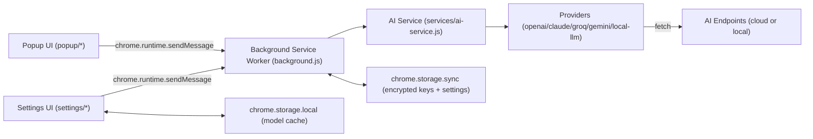
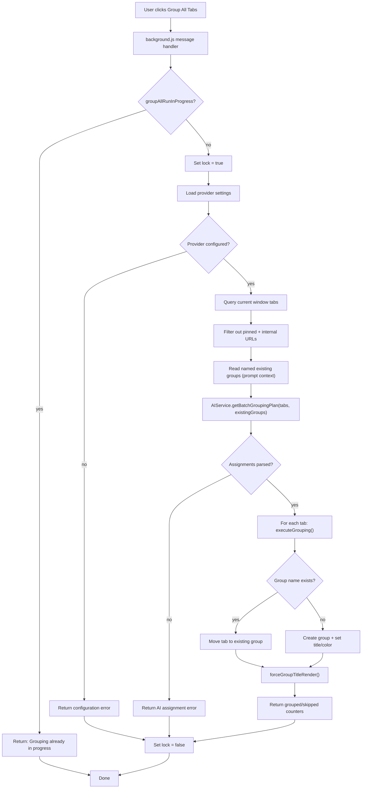
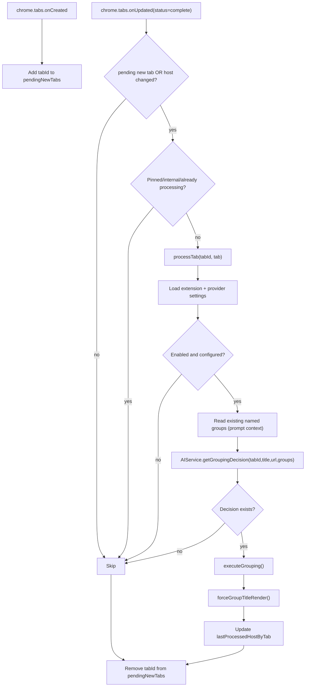
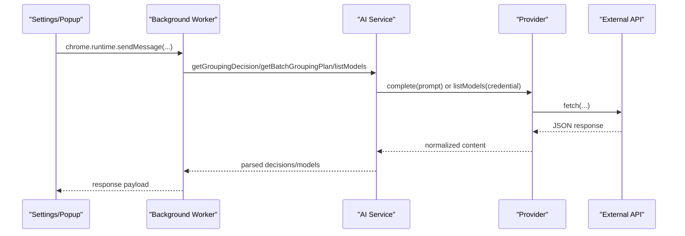
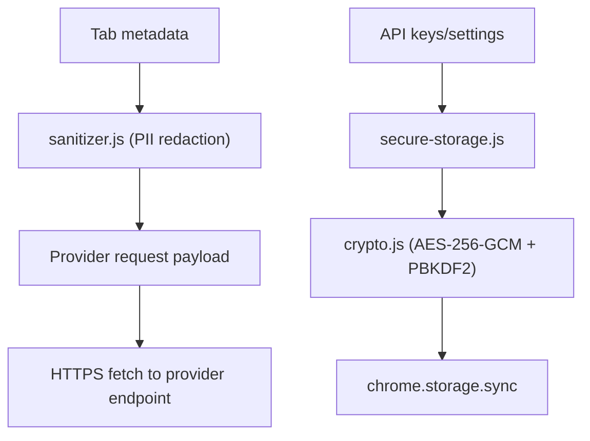
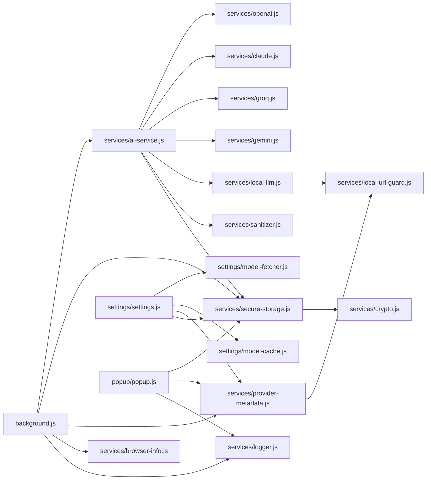

# Architecture

This document describes the runtime architecture, message flow, and security model of AI Tab Grouper.

## System Overview



## Runtime Diagrams

### Group All Tabs

`groupAllTabs`, `smartRegroupTabs`, and `rebuildTabs` all execute the same batch command.



### Auto-Grouping for New Tabs



## Security Architecture

### API Isolation and Message Boundary



### Data Protection Layers



Key points:

- UI pages do not call provider APIs directly.
- External HTTP calls are centralized in provider classes.
- Sensitive keys are encrypted at rest in `chrome.storage.sync`.
- Tab payloads are sanitized before provider calls.

## Module Dependencies



## Storage Structure

All extension data is stored under a unified `tabber` key namespace.

### Sync Storage (`chrome.storage.sync.tabber`)

```javascript
{
  enabled: boolean,
  defaultProvider: "openai" | "claude" | "groq" | "gemini" | "local",

  // Encrypted API keys
  openaiKey: "encrypted:v1:...",
  claudeKey: "encrypted:v1:...",
  groqKey: "encrypted:v1:...",
  geminiKey: "encrypted:v1:...",

  // Model selection
  openaiModel: string,
  claudeModel: string,
  groqModel: string,
  geminiModel: string,

  // Local model config (Ollama/LM Studio/OpenAI-compatible endpoint)
  localUrl: string,
  localModel: string,
  localApiFormat: "auto" | "openai" | "ollama",
  localStrictLoopback: boolean,
  localLoopbackUpgradeNoticeSeen: boolean
}
```

### Local Storage (`chrome.storage.local.tabber`)

```javascript
{
  fetchedModels: {
    openai: [{ id, displayName }],
    claude: [{ id, displayName }],
    groq: [{ id, displayName }],
    gemini: [{ id, displayName }]
  }
}
```

## Notes for Extending Providers

1. Implement `complete(prompt)` in a new provider class.
2. Optionally implement `listModels(apiKey)` for dynamic model discovery.
3. Register the provider in `services/ai-service.js`.
4. Add settings UI + validation.
5. Update `background.js` provider-configuration checks.
